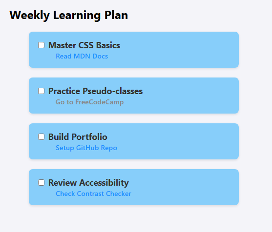

# CSS Link States Practice - To-Do List

A stylized To-Do List application built to practice HTML list structures and advanced CSS styling for anchor tag states. This project demonstrates specific visual feedback for user interactions including hovering, focusing, and visiting links.

## 📸 Screenshot



##  Live Demo

[View Project] https://simiyuu.github.io/productivity-dashboard/

##  Project Objective

The main goal of this lab was to implement different styles for links based on their interaction state, fulfilling specific user stories and passing automated tests.

### Key Features
* **Structured Layout:** Uses nested unordered lists (`<ul>`) to organize tasks and sub-tasks.
* **Form Elements:** Implements checkbox inputs linked to labels via the `for` attribute.
* **CSS Pseudo-classes:** Custom styling for all link states:
    * `a:link` (Unvisited) - Distinct color.
    * `a:visited` (Visited) - Changes color to indicate completion.
    * `a:hover` (Mouse Over) - Adds visual cue (underline/color change).
    * `a:focus` (Keyboard Selection) - High visibility outline for accessibility.
    * `a:active` (Clicking) - Immediate feedback color.

## Technologies Used

* **HTML5:** Semantic structure.
* **CSS3:** Styling, Flexbox/Grid (if applicable), and Pseudo-classes.

## User Stories Fulfilled

1.  **Structure:** Unordered list with class `todo-list` containing four list items.
2.  **Functionality:** Each item has a checkbox `input` and a corresponding `label`.
3.  **Links:** Nested unordered list `sub-item` containing anchor tags opening in a new tab (`target="_blank"`).
4.  **Styling Logic:**
    * Links have no default underline.
    * Distinct colors for unvisited, visited, hover, and active states.
    * Custom outline applied on focus.

##  How to Run

1.  Clone this repository:
    ```bash
    git clone [https://github.com/your-username/productivity-dashboard.git](https://github.com/Simiyuu/productivity-dashboard.git)
    ```
2.  Navigate to the project folder.
3.  Open `index.html` in your web browser.

##  Author

* **[Chandler Matere Simiyu]** - *Initial work*

---
*This project was created as part of a Web Development curriculum.*